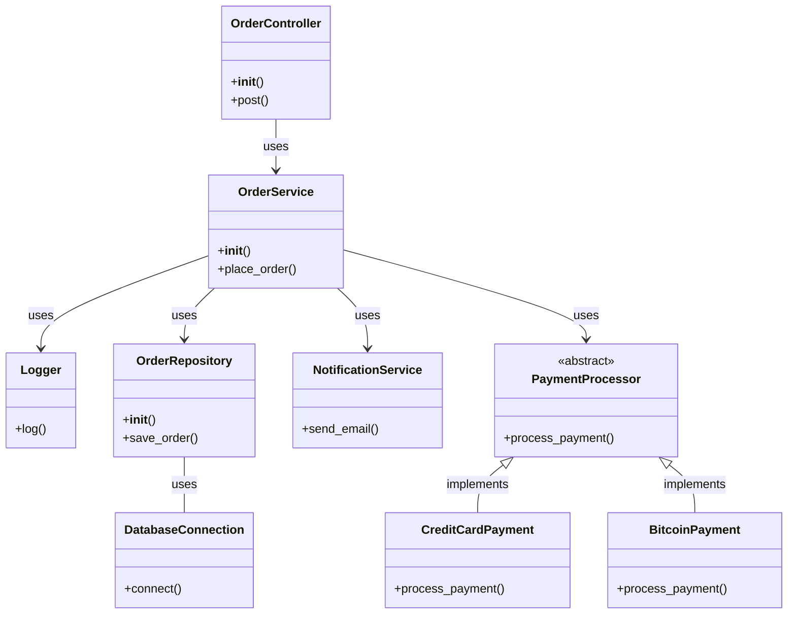

```mermaid
classDiagram
    class Logger {
        +log()
    }

    class DatabaseConnection {
        +connect()
    }

    class OrderRepository {
        +__init__()
        +save_order()
    }

    class NotificationService {
        +send_email()
    }

    class PaymentProcessor {
        <<abstract>>
        +process_payment()
    }

    class CreditCardPayment {
        +process_payment()
    }

    class BitcoinPayment {
        +process_payment()
    }

    class OrderService {
        +__init__()
        +place_order()
    }

    class OrderController {
        +__init__()
        +post()
    }

    OrderRepository -- DatabaseConnection : uses
    PaymentProcessor <|-- CreditCardPayment : implements
    PaymentProcessor <|-- BitcoinPayment : implements

    OrderService --> OrderRepository : uses
    OrderService --> NotificationService : uses
    OrderService --> PaymentProcessor : uses
    OrderService --> Logger : uses

    OrderController --> OrderService : uses
```